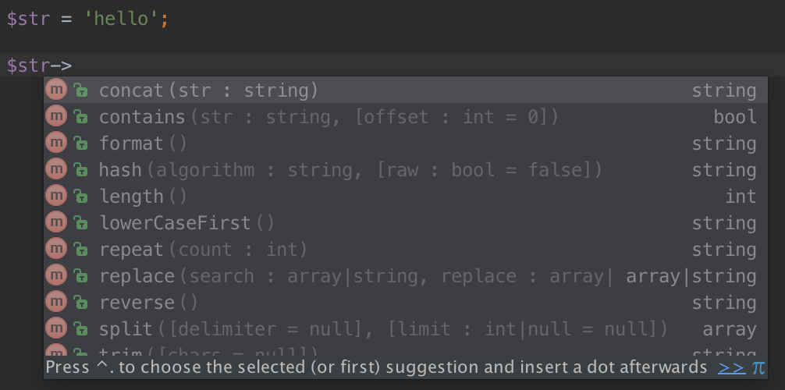

PHP scalar
==========

[](https://travis-ci.org/nkt/php-scalar)

> Methods for PHP scalars.

Installation
------------

Install great @nikic [extension](https://github.com/nikic/scalar_objects)
that allows add methods to scalar objects.

```
git clone git://github.com/nikic/scalar_objects.git
cd scalar_objects
phpize
./configure
make
sudo make install
```

Then add `nkt/scalar` into your `composer.json`. That's it!

IDE
---

PHPStorm/IDEA recognize scalars as classes (int, string, etc.)
so I've added stub, that provide simple completion for this library.
Unfortunately `array` is a keyword in grammars, so there is no completion for it.



License
-------

[MIT](LICENSE)
